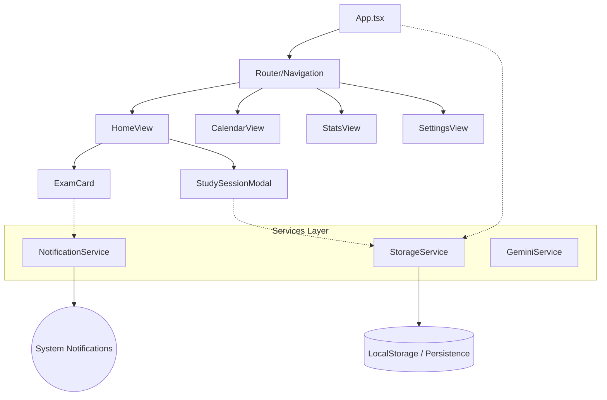

<div align="center">
  

# 🚀 Aways+ (Aways Plus)

**La Evolución del Estudio: Gamificación, Organización y Alto Rendimiento.**

[](https://semver.org)
[](https://react.dev/)
[](https://www.typescriptlang.org/)
[](https://capacitorjs.com/)
[](LICENSE)

  <p align="center">
    <a href="#-visión-del-proyecto">Visión</a> •
    <a href="#-características-y-mecánicas">Mecánicas</a> •
    <a href="#-arquitectura-del-sistema">Arquitectura</a> •
    <a href="#-instalación-y-despliegue">Instalación</a> •
    <a href="#-roadmap">Roadmap</a>
  </p>
</div>

---

## � Visión del Proyecto

**Aways+** nace de una necesidad simple: **estudiar es aburrido, pero subir de nivel es adictivo**.

Esta aplicación no es simplemente un calendario de exámenes; es un **Sistema de Gestión de Aprendizaje Gamificado** (GLMS). Utiliza principios de psicología conductual para reforzar hábitos positivos, transformando horas de estudio tediosas en puntos de experiencia (XP), niveles y recompensas tangibles. Diseñada con una estética **Neo-Brutalista**, prioriza la claridad, la velocidad y el impacto visual.

---

## ⚡ Características y Mecánicas

### 🧬 El Algoritmo del Éxito (Gamificación)

Aways+ implementa un sistema de progresión matemática para mantenerte motivado:

| Nivel | Título      | Requisito (Minutos Totales) | Descripción                             |
| :---- | :---------- | :-------------------------- | :-------------------------------------- |
| **1** | Cadete      | 0                           | El inicio de tu viaje.                  |
| **2** | Estudiante  | 60                          | Has completado tu primera hora real.    |
| **3** | Analista    | 300                         | La constancia empieza a dar frutos.     |
| **4** | Estratega   | 1000                        | Entiendes el valor de la planificación. |
| **5** | Maestro     | 3000                        | Eres un experto en tu campo.            |
| **6** | **LEYENDA** | 10000                       | La excelencia es tu hábito.             |

### 🏆 Sistema de Logros Dinámico

Más de **50 logros únicos** divididos en categorías:

- ⏳ **Tiempo**: Premios por acumulación total de horas.
- 🔥 **Racha**: Recompensas por consistencia diaria (Streak System).
- 🎯 **Exámenes**: Trofeos por supervivencia académica.
- 🌟 **Especiales**: Desafíos ocultos (ej. "Búho Nocturno" por estudiar a las 3 AM).

### 🧠 Modo Foco Inmersivo

Un entorno libre de distracciones con:

- **Temporizador Pomodoro Personalizable**.
- **Seguimiento de Temas**: Asocia cada minuto a un tema específico del syllabus.
- **Feedback Visual**: Animaciones de pulso y progreso en tiempo real.

---

## 🏛️ Arquitectura del Proyecto

El proyecto sigue una arquitectura modular basada en **Componentes** y **Servicios**, asegurando escalabilidad y mantenibilidad.



### 📂 Estructura de Directorios

```bash
/src
├── /components      # UI Reutilizable (Cards, Modals, Nav)
├── /services        # Lógica de Negocio y APIs
│   ├── notificationService.ts  # Gestión de Push Notifications
│   ├── storageService.ts       # Capa de Persistencia Local
│   └── geminiService.ts        # Integración IA (Google Gemini)
├── /types.ts        # Definiciones de Tipos TypeScript (Core Domain)
├── App.tsx          # Punto de Entrada y Gestión de Estado Global
└── main.tsx         # Bootstrapping React
/android             # Proyecto Nativo Android (Generado por Capacitor)
```

---

## � Instalación y Despliegue

### Requisitos Previos

- **Node.js** (v18+)
- **Java JDK 17** (Estrictamente necesario para builds Android)
- **Android Studio** (Opcional, solo si quieres emuladores)

### 1. Configuración del Entorno

```bash
git clone https://github.com/tu-usuario/aways-plus.git
cd aways-plus
npm install
```

### 2. Ejecutar en Desarrollo

Servidor local con Hot-Reload gracias a Vite:

```bash
npm run dev
```

### 3. Generar APK (Producción)

Proceso optimizado para generar el instalable Android:

```bash
# 1. Empaquetar la web
npm run build

# 2. Sincronizar con capa nativa
npx cap sync

# 3. Compilar APK (Debug)
cd android
./gradlew assembleDebug
```

> **Nota**: El build Release requiere firmado de llaves (ver `BUILD_GUIDE.md`).

---

## 🗺️ Roadmap & Futuro

El desarrollo de Aways+ nunca se detiene. Aquí está lo que viene:

- [ ] **Sincronización en la Nube**: Backup de tus datos en Firebase/Supabase.
- [ ] **Modo Multijugador**: Compite con amigos en ránkings semanales.
- [ ] **IA Tutor**: Análisis de tus patrones de estudio con Google Gemini para sugerir descansos óptimos.
- [ ] **Widgets**: Visualiza tu progreso desde la pantalla de inicio de Android.

---

## 🤝 Contribución

¡Las contribuciones son bienvenidas! Si tienes una idea para un nuevo logro o una mejora de interfaz:

1.  Haz un Fork del proyecto.
2.  Crea tu rama de funcionalidad (`git checkout -b feature/AmazingFeature`).
3.  Commit a tus cambios (`git commit -m 'Add some AmazingFeature'`).
4.  Push a la rama (`git push origin feature/AmazingFeature`).
5.  Abre un Pull Request.

---

<div align="center">
  <p>Construido con pasión, código y mucha cafeína ☕</p>
  <p>© 2025 Aways Team Project</p>
</div>
